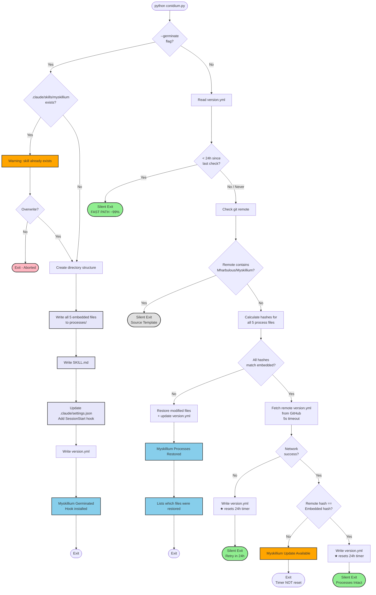

# Homeostasis

## Definition

In the myskillium context, homeostasis refers to **protecting core processes from accidental modification through regular checking and automatic restoration**. Just as biological homeostasis maintains cellular integrity, skill homeostasis maintains process integrity across distributed repositories.

Key parallels:
- Sensing = hash comparison of core process files
- Regulatory response = detecting drift from canonical versions
- Restoration = overwriting modified files with canonical content
- Continuous monitoring = periodic checks (24h cycle)

## Purpose

Ensure consistency of core myskillium processes across all repositories:

1. **Detect drift** - Identify when core process files have been modified
2. **Restore canonical state** - Overwrite modified files with embedded versions
3. **Prevent fragmentation** - Keep all repos aligned with source-of-truth
4. **Enable safe experimentation** - Users can modify knowing restoration is automatic

## The Conidium Script

`conidium.py` is a portable, self-contained script that serves two purposes:

1. **Germination** - Bootstrap myskillium into a new repository
2. **Homeostasis** - Maintain consistency on each Claude Code session

### Embedded Content

The script embeds all five essential myskillium files:

| File | Purpose |
|------|---------|
| `processes/conidiation.md` | Spore creation process |
| `processes/fragmentation.md` | Skill extraction process |
| `processes/plasmogamy.md` | Skill fusion process |
| `processes/homeostasis.md` | This file - consistency maintenance |
| `processes/pedigree.json` | Template for genealogy records |

### Relationship to myskillium-spore.py

| Aspect | myskillium-spore.py | conidium.py |
|--------|---------------------|-------------|
| **Primary role** | Bootstrap planning docs | Bootstrap + maintain myskillium skill |
| **Embedded content** | 7 planning docs (01-07) | 5 process definitions |
| **Target directory** | `.claude/skills/bootstrap/` | `.claude/skills/myskillium/` |
| **Germination** | Writes docs on first run | `--germinate` flag creates full skill |
| **Hook behavior** | Checks for updates | Restores drifted processes |

## Conidium Workflow



## Germination Mode

When a user copies `conidium.py` to their repository and runs:

```bash
python .claude/skills/myskillium/scripts/conidium.py --germinate
```

The script:

1. **Creates directory structure**
   ```
   .claude/skills/myskillium/
   ├── SKILL.md
   ├── version.yml
   ├── processes/
   │   ├── conidiation.md
   │   ├── fragmentation.md
   │   ├── homeostasis.md
   │   ├── plasmogamy.md
   │   └── pedigree.json
   └── scripts/
       └── conidium.py
   ```

2. **Installs SessionStart hook** in `.claude/settings.json`:
   ```json
   {
     "hooks": {
       "SessionStart": [
         {
           "matcher": {},
           "hooks": [
             {
               "type": "command",
               "command": "python .claude/skills/myskillium/scripts/conidium.py"
             }
           ]
         }
       ]
     }
   }
   ```

3. **Writes version.yml** with current timestamp and embedded hash

## Homeostasis Mode

After germination, `conidium.py` runs automatically on each Claude Code session start via the installed hook.

### Phase 1: Fast Path Check (24h cooldown)

```
if version.yml exists AND last_check < 24h ago:
    exit silently (most common path)
```

This prevents unnecessary overhead on every session.

### Phase 2: Source Template Detection

```
if git remote contains "Mharbulous/Myskillium":
    exit silently (source never self-restores)
```

The canonical source template must be freely editable.

### Phase 3: Process Hash Comparison

For each of the 5 embedded files:
1. Calculate SHA-256 hash of local file content
2. Compare against embedded canonical hash
3. Track which files have drifted

### Phase 4: Restoration (if needed)

If any file has drifted:
1. Overwrite modified files with embedded canonical content
2. Update `version.yml` with new timestamp
3. Report which files were restored

### Phase 5: Remote Update Check

If all files match:
1. Fetch remote `version.yml` from GitHub
2. Compare remote hash against embedded hash
3. Notify if newer version available upstream

## 24h Cooldown Behavior

| Outcome | Writes version.yml? | Next session behavior |
|---------|---------------------|----------------------|
| Fast path (<24h) | No | Fast exit again |
| Source template | No | Fast exit (no version.yml needed) |
| Processes restored | **Yes** | Fast exit for 24h |
| Network error | **Yes** | Fast exit for 24h |
| Update available | No | Check again (intentional reminder) |
| All intact | **Yes** | Fast exit for 24h |

## Relationship to Other Processes

| Process | Homeostasis Role |
|---------|-----------------|
| **Conidiation** | Protects the spore-creation process definition |
| **Fragmentation** | Ensures extraction rules remain consistent across repos |
| **Plasmogamy** | Ensures fusion rules remain consistent across repos |

Homeostasis is the **guardian** of the other three processes. Without homeostasis:
- Process drift across repos would corrupt skill genealogy
- Incompatible extraction/fusion rules would produce broken skills
- The myskillium network would fragment into incompatible variants

## Self-Protection Paradox

Homeostasis protects itself (`homeostasis.md`). This creates a bootstrapping consideration:

- The embedded hash of `homeostasis.md` must be updated whenever this file changes
- Changes to homeostasis require updating `conidium.py` to embed the new canonical content
- This is intentional: modifying the protection mechanism requires deliberate action in the source template

## Checklist

- [ ] `conidium.py` embeds all 5 process files as strings
- [ ] `--germinate` flag creates full directory structure
- [ ] `--germinate` installs SessionStart hook in settings.json
- [ ] Hash calculation matches algorithm in `myskillium-spore.py`
- [ ] 24h cooldown prevents excessive checking
- [ ] Source template detection prevents self-restoration
- [ ] Restoration overwrites only modified files
- [ ] User is notified which files were restored
- [ ] Remote update check occurs after local verification
- [ ] `version.yml` tracks last check timestamp and hash
