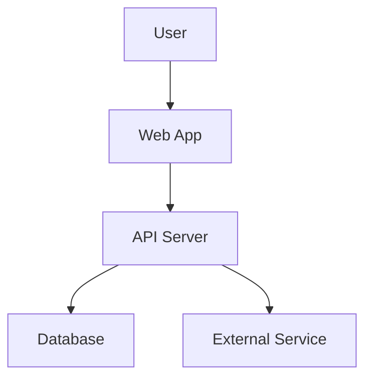

# Advanced Features

Load this file when implementing advanced documentation features.

## Multi-Language Documentation

If the project needs documentation in multiple languages:

### 1. Ask User Which Languages

```
Which languages should the documentation support?
- English (default)
- Spanish
- French
- German
- Chinese
- Japanese
- Other (specify)
```

### 2. Create Language Structure

```
docs/
├── en/
│   ├── getting-started/
│   └── [all sections]
├── es/
│   ├── getting-started/
│   └── [all sections - mark for translation]
└── fr/
    └── [all sections - mark for translation]
```

### 3. Configure SSG for i18n

**MkDocs**: Use `i18n` plugin

```yaml
plugins:
  - i18n:
      default_language: en
      languages:
        en: English
        es: Español
        fr: Français
```

**Docusaurus**: Built-in i18n support

```javascript
i18n: {
  defaultLocale: 'en',
  locales: ['en', 'es', 'fr'],
},
```

**VitePress**: Configure locales in config

```javascript
locales: {
  root: { label: 'English', lang: 'en' },
  es: { label: 'Español', lang: 'es' },
  fr: { label: 'Français', lang: 'fr' },
}
```

### 4. Mark Translation Needs

```markdown
> **Translation needed**: This content is in English.
> Translate to: [Target Language]
```

## Documentation Versioning

For projects with multiple versions:

### 1. Ask If Versioning Needed

```
Do you need to maintain documentation for multiple versions?
- Yes, I support multiple major versions
- No, only latest version
```

### 2. Set Up Version Management

**Docusaurus**:
```bash
npm run docusaurus docs:version 1.0
```

**MkDocs**: Use `mike` plugin
```bash
pip install mike
mike deploy 1.0 latest
mike set-default latest
```

**VitePress**: Manual version directories
```
docs/
├── v1/
├── v2/
└── latest/ → symlink to current
```

### 3. Document Versioning Strategy

```markdown
# Documentation Versioning

Versions maintained:
- **Latest**: Main branch documentation
- **v2.x**: Stable release (recommended)
- **v1.x**: Legacy (security updates only)

To document a new version:
[Instructions for chosen SSG]
```

## API Documentation Integration

If OpenAPI/Swagger specs exist:

### 1. Detect Spec Files

```bash
find . -name "openapi.yaml" -o -name "swagger.json" -o -name "openapi.json"
```

### 2. Integrate with SSG

**Docusaurus**: Use `docusaurus-plugin-openapi-docs`

```bash
npm install docusaurus-plugin-openapi-docs docusaurus-theme-openapi-docs
```

**MkDocs**: Use `mkdocs-swagger-ui-tag`

```yaml
plugins:
  - swagger-ui-tag
```

**VitePress**: Embed Swagger UI component

### 3. Generate User-Friendly API Guides

Don't rely solely on auto-generated API docs. Create guides showing:
- Common API workflows
- Authentication examples
- Pagination patterns
- Error handling

## Interactive Examples

For web applications, include interactive demos:

### 1. Create Examples Directory

```
examples/
├── basic-usage.html
├── advanced-feature.html
└── integration-demo.html
```

### 2. Generate Simple HTML Demos

```html
<!-- examples/feature-demo.html -->
<!DOCTYPE html>
<html>
<head>
    <title>[Feature] Demo</title>
    <style>
        body { font-family: sans-serif; padding: 20px; }
        .demo { border: 1px solid #ccc; padding: 20px; margin: 10px 0; }
    </style>
</head>
<body>
    <h1>[Feature] Interactive Demo</h1>

    <div class="demo">
        <!-- Interactive example here -->
    </div>

    <p><a href="view-source:">View source</a> to see implementation.</p>

    <script>
        // Minimal working example
    </script>
</body>
</html>
```

### 3. Link from Documentation

```markdown
> **Try it live**: [Interactive demo](../examples/feature-demo.html)
```

## Video Tutorial Placeholders

When marking video needs, be specific:

```markdown
> **Video Tutorial: Getting Started (5 minutes)**
>
> **Script outline**:
> 1. Introduction (0:00-0:30): Welcome, what you'll learn
> 2. Installation (0:30-2:00): Show install process on [OS]
> 3. First run (2:00-3:30): Walk through quick start
> 4. Explore UI (3:30-4:30): Tour main features
> 5. Wrap up (4:30-5:00): Next steps, where to learn more
>
> **Required footage**:
> - Screen recording of installation
> - Screen recording of first successful run
> - Cursor highlighting key UI elements
>
> **Recommended tools**:
> - Loom (easy, web-based)
> - OBS Studio (advanced, more control)
```

## Diagram Placeholders

```markdown
> **Diagram: System Architecture**
>
> **Should show**:
> - User's browser/client
> - API layer
> - Database
> - External services
> - Data flow arrows
>
> **Recommended tools**:
> - Excalidraw (hand-drawn style)
> - Draw.io (professional)
> - Mermaid (code-based, embeddable)
```

### Mermaid Diagram Example

If using MkDocs or Docusaurus with Mermaid support:

```markdown

```

## Search Configuration

### MkDocs Material

Built-in search, no configuration needed.

### Docusaurus with Algolia

```javascript
themeConfig: {
  algolia: {
    appId: 'YOUR_APP_ID',
    apiKey: 'YOUR_SEARCH_API_KEY',
    indexName: 'YOUR_INDEX_NAME',
  },
},
```

### VitePress Local Search

```javascript
themeConfig: {
  search: {
    provider: 'local'
  }
}
```

## Analytics Integration

### Google Analytics

**MkDocs**:
```yaml
extra:
  analytics:
    provider: google
    property: G-XXXXXXXXXX
```

**Docusaurus**:
```javascript
presets: [
  [
    '@docusaurus/preset-classic',
    {
      gtag: {
        trackingID: 'G-XXXXXXXXXX',
      },
    },
  ],
],
```

**VitePress**:
```javascript
head: [
  ['script', { async: '', src: 'https://www.googletagmanager.com/gtag/js?id=G-XXXXXXXXXX' }],
]
```

## Feedback Widget

Add a "Was this page helpful?" widget:

**Docusaurus**: Built-in feedback plugin available

**Custom implementation**:
```html
<div class="feedback">
  <p>Was this page helpful?</p>
  <button onclick="sendFeedback('yes')">Yes</button>
  <button onclick="sendFeedback('no')">No</button>
</div>
```
