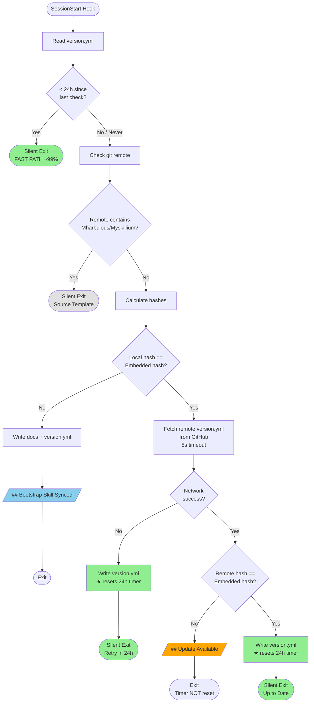

# Bootstrap Hook Workflow



## 24h Cooldown Behavior

| Outcome | Writes version.yml? | Next session behavior |
|---------|---------------------|----------------------|
| Fast path (<24h) | No | Fast exit again |
| Source template | No | Fast exit (no version.yml needed) |
| Sync | **Yes** | Fast exit for 24h |
| Network error | **Yes** | Fast exit for 24h |
| Update available | No | Check again (intentional reminder) |
| Up to date | **Yes** | Fast exit for 24h |

**Key insight**: Network failures write `version.yml`, so the hook won't retry until 24h later. This prevents exacerbating network outages.

## Performance Notes

- **Fast path** (~99%): Only loads `os`, `sys`, `datetime`, `pathlib` (~1ms file read)
- **Steps 2-4**: Lazy-load `subprocess`, `hashlib`, `urllib` only when needed
- **Max overhead**: One 5-second network attempt per 24h, regardless of success/failure

## Why version.yml Everywhere

Both local and remote use the same `version.yml` format:

```yaml
# .claude/skills/bootstrap/version.yml
last_check: "2025-01-15T12:00:00"
hash: "abc123..."
```

- **Same format** - simpler mental model, no separate `.hash` file
- **Human-readable** - can inspect deployed version at a glance
- **Trivial parsing** - just find the `hash:` line
