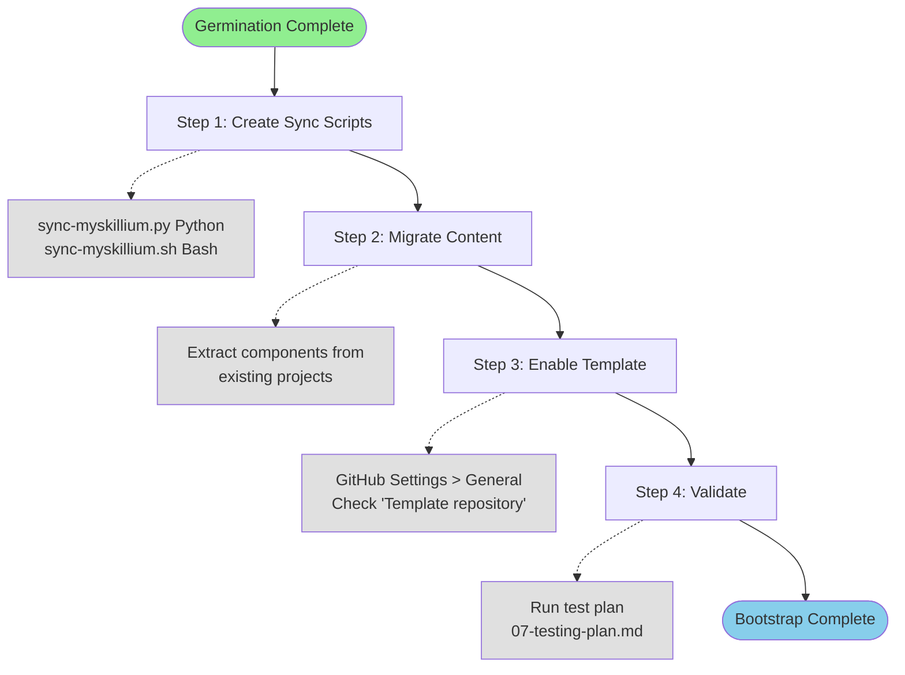

# Myskillium Bootstrap Plan

## References

- `04-sync-script-spec.md` - Sync script implementation specification
- `05-scrape-plan.md` - Content migration plan
- `07-testing-plan.md` - Validation and testing procedures
