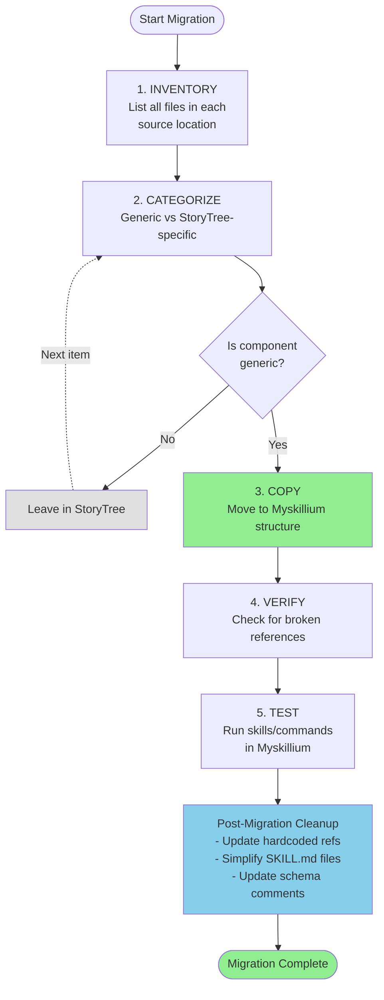

# Content Migration Workflow

## Source Mappings

| From | To |
|------|-----|
| `StoryTree/distributables/claude/skills/` | `.claude/skills/` |
| `StoryTree/distributables/claude/commands/` | `.claude/commands/` |
| `StoryTree/distributables/claude/scripts/` | `.claude/scripts/` |
| `StoryTree/distributables/claude/data/schema.sql` | `.claude/data/schema.sql` |
| `StoryTree/distributables/github/workflows/` | `.github/workflows/` |
| `StoryTree/gui/` | `gui/` |

## Do Not Migrate

- Submodule infrastructure (setup.py, manifests)
- StoryTree-specific docs (ai_docs/)
- Database files (*.db)
- Symlinks (copy actual content)
