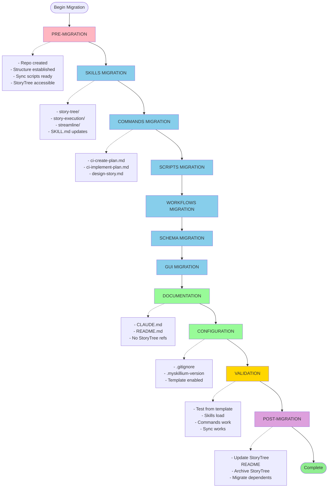

# Migration Phases

## Phase Summary

| Phase | Category | Key Items |
|-------|----------|-----------|
| **Pre-Migration** | Setup (Pink) | Repo created, Structure established, Sync scripts ready, StoryTree accessible |
| **Skills Migration** | Core (Blue) | story-tree/, story-execution/, streamline/, SKILL.md updates |
| **Commands Migration** | Core (Blue) | ci-create-plan.md, ci-implement-plan.md, design-story.md |
| **Scripts Migration** | Core (Blue) | Migration of script files |
| **Workflows Migration** | Core (Blue) | Migration of workflow files |
| **Schema Migration** | Core (Blue) | Migration of schema definitions |
| **GUI Migration** | Core (Blue) | Migration of GUI components |
| **Documentation** | Docs/Config (Green) | CLAUDE.md, README.md, No StoryTree refs |
| **Configuration** | Docs/Config (Green) | .gitignore, .myskillium-version, Template enabled |
| **Validation** | Testing (Gold) | Test from template, Skills load, Commands work, Sync works |
| **Post-Migration** | Cleanup (Purple) | Update StoryTree README, Archive StoryTree, Migrate dependents |

## Migration Flow

The migration follows a linear progression from setup through core migrations, documentation, validation, and cleanup:

1. **Setup Phase**: Establish repository structure and sync mechanisms
2. **Core Migrations**: Migrate skills, commands, scripts, workflows, schema, and GUI in sequence
3. **Documentation & Configuration**: Update all documentation and configuration files
4. **Validation**: Comprehensive testing of all migrated components
5. **Cleanup**: Archive old system and migrate dependent projects

Dotted lines in the diagram indicate detailed checklist items for each major phase.
