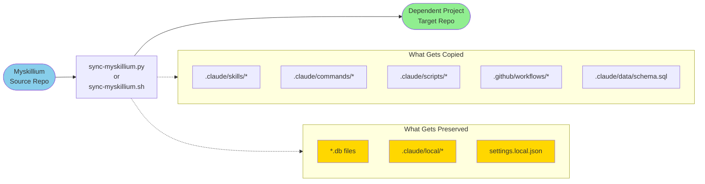

# Myskillium Sync Model

## Overview

Data flow from Myskillium source repository to dependent target repositories via sync scripts. The sync mechanism ensures that core Claude configuration and workflows stay up-to-date while preserving project-specific data.

## Usage Modes

- **Template**: For new projects - complete initial setup
- **Sync**: For existing projects - update shared resources while preserving local state

## Version Tracking

Version is tracked in `.myskillium-version` to detect when updates are needed and prevent unnecessary syncs.

## What Gets Copied

The sync scripts copy these shared resources from Myskillium:

- `.claude/skills/*` - Reusable Claude skills
- `.claude/commands/*` - Custom slash commands
- `.claude/scripts/*` - Helper scripts
- `.github/workflows/*` - GitHub Actions workflows
- `.claude/data/schema.sql` - Database schema

## What Gets Preserved

These project-specific files are never overwritten:

- `*.db files` - Local databases
- `.claude/local/*` - Project-specific configurations
- `settings.local.json` - Local settings
