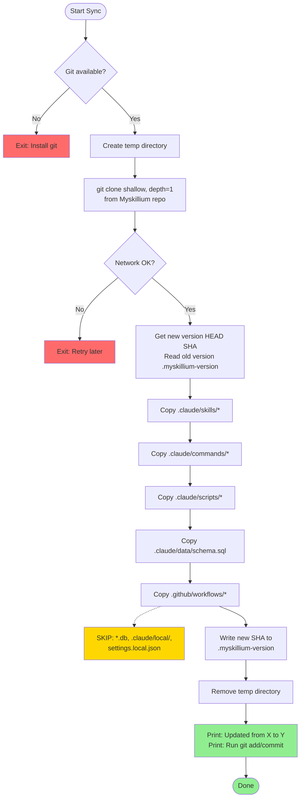

# Sync Script Algorithm

## Error Handling Notes

| Error Condition | Exit Point | User Action Required |
|-----------------|------------|---------------------|
| Git not installed | ERROR_GIT | Install git and retry |
| Network failure (clone) | ERROR_NETWORK | Check connection and retry later |
| Temp directory creation fails | CREATE_TEMP | Check disk space and permissions |

## File Preservation

The sync script **preserves** local files that should not be overwritten:

- **Database files**: `*.db` (local skill data)
- **Local directory**: `.claude/local/` (user-specific configs)
- **Local settings**: `settings.local.json` (user overrides)

These files are intentionally skipped during the copy process to prevent data loss.

## Script Variants

- **Python**: `sync-myskillium.py` - Cross-platform, requires Python 3.6+
- **Shell**: `sync-myskillium.sh` - Unix/Linux/macOS native, requires bash

Both scripts implement the same algorithm and produce identical results.

## Source Repository

- **URL**: https://github.com/Mharbulous/Myskillium.git
- **Branch**: main
- **Clone method**: Shallow clone (depth=1) for minimal bandwidth
