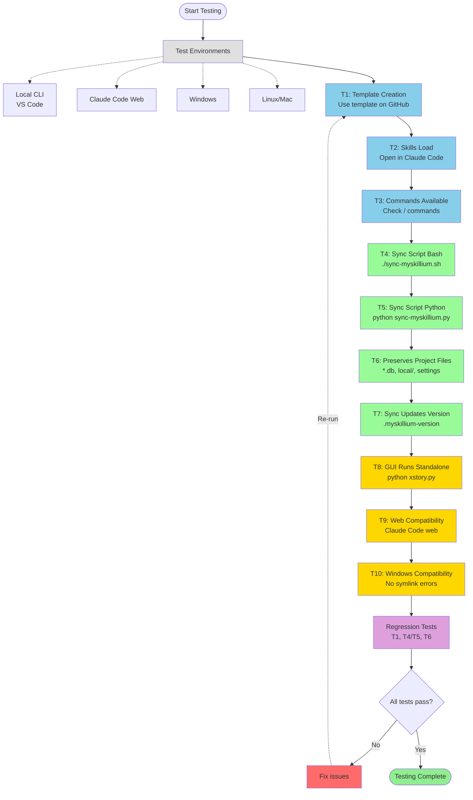

# Testing Workflow

## Test Groups

| Category | Tests | Description | Color |
|----------|-------|-------------|-------|
| Core Template Tests | T1, T2, T3 | Verify template creation and basic Claude Code integration | Sky Blue (#87CEEB) |
| Sync Tests | T4, T5, T6, T7 | Validate sync scripts and version management | Pale Green (#98FB98) |
| Compatibility Tests | T8, T9, T10 | Ensure cross-platform and environment compatibility | Gold (#FFD700) |
| Regression Tests | T1, T4/T5, T6 | Re-run critical tests to prevent breaking changes | Plum (#DDA0DD) |

## Known Limitations

- **Manual Sync**: Sync is manual (not automatic) - users must run sync scripts explicitly
- **GUI Dependencies**: GUI requires Python + PySide6 installation
- **Repository Size**: Large files may slow clone operations

## Test Flow Notes

The testing workflow follows a sequential progression through three main categories:

1. **Core Template Tests (Blue)**: Establish baseline functionality
2. **Sync Tests (Green)**: Verify update mechanism works correctly
3. **Compatibility Tests (Gold)**: Ensure cross-platform support

After all tests, regression tests validate that core functionality remains intact. If any test fails, issues must be fixed and testing resumes from T1.
